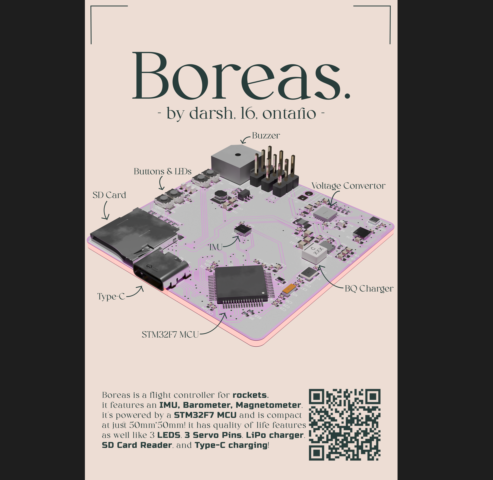
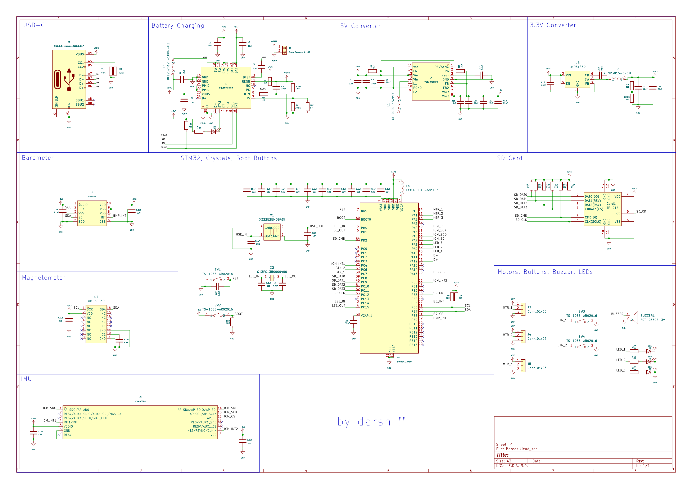
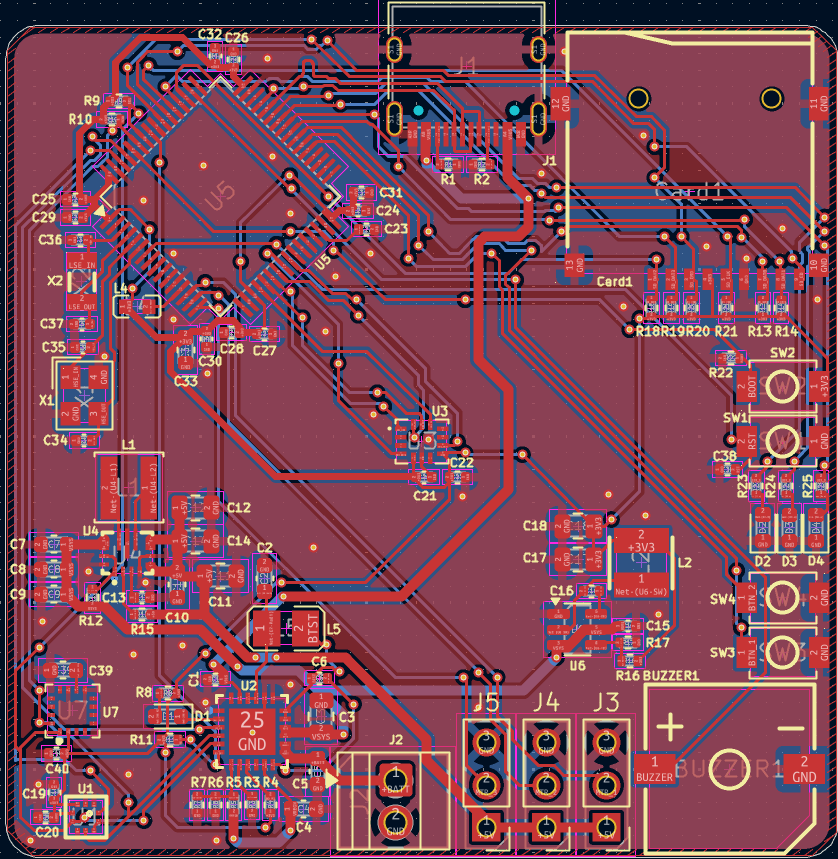

# Boreas

a flight controller for a rocket.

made this project to both learn how to make flight controllers in general for my drone, and for my future rocket that i'll be launching, which will use this. making it i got some more practice in routing pcbs and how to read datasheets!

it uses an STM32F7 as an mcu, connected to an imu, barometer, and magnometer. it also has 3 leds, two buttons, a buzzer, and 3 servo motor pins. it can also charge lipo batteries through usb-c! lastly it has an sd card reader for data display!

## BOM

|Item    |Price (USD)|
|--------|-----------|
|PCB     |2          |
|PCBA    |198.65     |
|Shipping|26.51      |
|        |           |
|Total   |227.16     |
